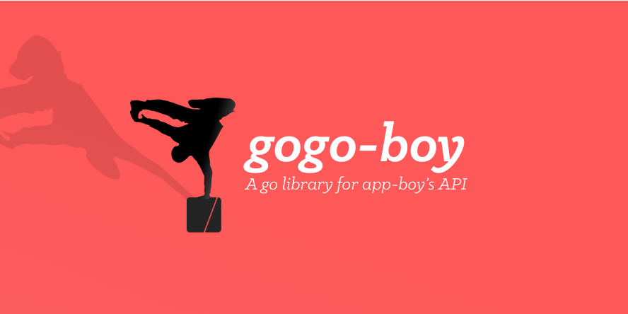

 

[](https://github.com/sotownsend/yipyap/blob/master/LICENSE)
[](https://circleci.com/gh/sotownsend/gogo-boy)

# What is this?

This package assists with raw server communication for app-boy's API.  It is concurrency safe but only provides
a very thin layer on-top of the HTTP interface; you should probably have your own way of ensuring reliability by queing or pooling your connections.

# Missing Features

There (I presume) many missing features of the app-boy API that are not covered here.  This only covers thing that were required for what we were working on at the time.

# Example usage

```go
import "gogo_boy"

// Run this once to configure the app and group id
gogo_boy.Configure(appGroupId, appId)

// Create a new track request for a user id
track := gogo_boy.NewTrackRequest(userId)

// Set attributes
track.SetFirstName("foo")
track.SetEmail("test@test.com")
track.SetCustomValueAttribute("baz", "bar")

// Add push token
track.AddPushToken("foo")

// Post events
e := gogo_boy.NewEvent()
e.SetName("foo")
a.SetTime(time.Now())
track.AddEvent(a)

// Add purchases
pe := gogo_boy.NewPurchaseEvent()
pe.SetProductId("blah")
pe.SetCurrencyUSD()
pe.SetPrice(4.29)
pe.SetQuantity(1)
pe.SetTime(time.Unix(0, 0))
track.AddEvent(pe)

// Post and check for errors
err := track.Post()
checkErr(err)
```

# Serialization
The track request is marshable and unmarshable into json via `json.Marshal()`. This allows you to save the request and post it at a later time.

## Communication
> ♥ This project is intended to be a safe, welcoming space for collaboration, and contributors are expected to adhere to the [Contributor Covenant](http://contributor-covenant.org) code of conduct.

- If you **found a bug**, open an issue.
- If you **have a feature request**, open an issue.
- If you **want to contribute**, submit a pull request.

---

## FAQ

Todo

### Creator

- [Seo Townsend](http://github.com/sotownsend) ([@seotownsend](https://twitter.com/seotownsend))


## License

lzoned is released under the MIT license. See LICENSE for details.
